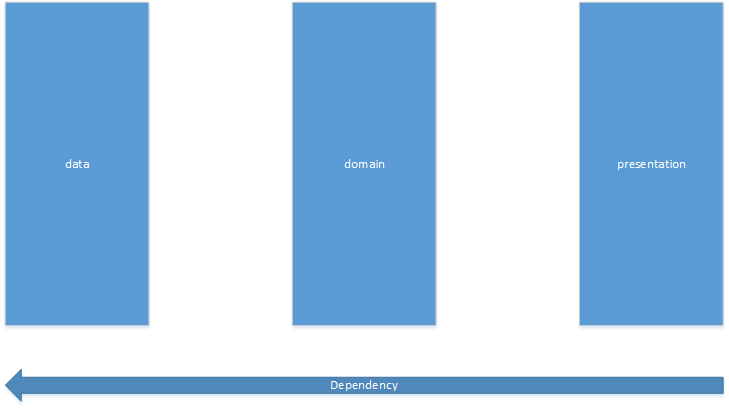
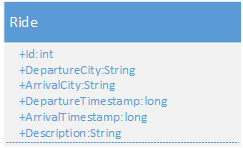
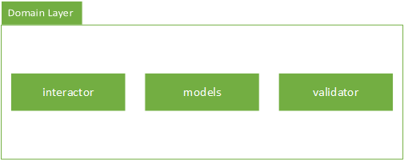
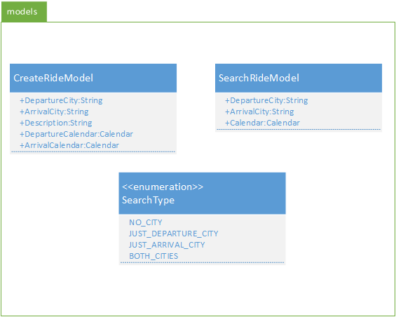
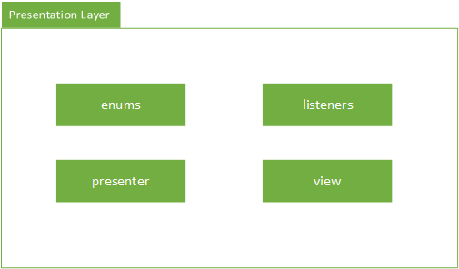
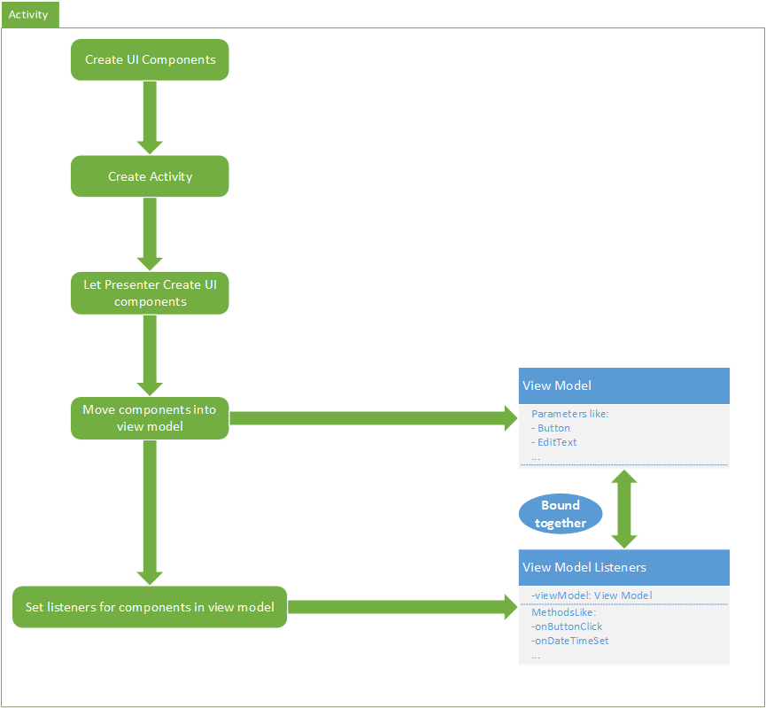

# Android Mitfahren

This is an app created in the course "Android" of the Ostfalia Hochschule für angewandte Wissenschaften in Wolfenbüttel. It lets you create ride requests and also search for them.

## Install
1. Clone the project
2. Build the project with gradlew or open it with Android Studio.

## Table of Content
1. **[General Architecture](#general-architecture)**
2. **[Data Layer](#data-layer)**
 * **[Database package](#database-package)**
 * **[Entity package](#entity-package)**
 * **[Repository package](#repository-package)**
3. **[Domain Layer](#domain-layer)**
 * **[Interactor Package](#interactor-Package)**
 * **[Models package](#Models-package)**
 * **[Validator package](#validator-package)**
4. **[Presentation Layer](#presentation-Layer)**
 * **[Basic overview](#basic-overview)**
 * **[Enums package](#enums-package)**
 * **[Listeners package](#listeners-package)**
 * **[Presenter package](#presenter-package)**
 * **[View package](#view-package)**
    * **[Activity package](#activity-package)**
    * **[Adapter package](#adapter-package)**
    * **[Model package](#model-package)**
5. **[Contribution](#contribution)**
6. **[License](#license)**

## General Architecture

As you can see we have divided the application in three layers:
- Data Layer
- Domain Layer
- Presentation Layer

We also have a dependency rule. It goes from the outside to the inner core of the application which is the data layer. This is really important to structure the logic and to encapsulate data.

## Data Layer
The data layer is the lowest layer of the application. It is handling all raw data operations like:
- Creating Data
- Reading Data
- Updating Data
- Deleting Data

So this is a simple [CRUD application](https://en.wikipedia.org/wiki/Create,_read,_update_and_delete).
We decided to use the local database of your android phone because this was a requirement.

We have three packages in this layer:
- Database package
- Entity package
- Repository package

### Database package
The database package contains all the required code for working with the local database. Because we need the database just once we have created a singleton containing the database as property. Also this package has classes which defines table schemes.

### Entity package
Then we have created the entity package which contains the entities **of the database**. Currently we only have one entity which is Ride.

### Repository package
We also have a repository package which is a basic repository and let you easily exchange the persistence component behind the data layer. With this repository pattern it is super easy to change the system to an actual REST api.

The repository needs to implement an interface which contains these methods:
- void InsertOrUpdateRide(Ride ride)
- ArrayList<Ride> SearchRides(String startPoint, String endPoint, long departureTime, SearchType searchType)

You can find more information of the repository in the javadoc.

## Domain Layer
The domain layer contains all the business logic of the application. It has a dependency on the data layer but not on the presentation layer so it should not access instances or other classes, methods, variables of the presentation layer.
The dependency to the data layer is just there to give access to the data. The data will be provided by the repository which was declared earlier.

The domain layer contains three packages:
- Interactor package
- Models package
- Validator package

### Interactor Package
The interactor package contains the interactor for the repository patttern of the data layer. This should be the only class which should have a dependency on the data layer.

### Models package
This package contains the models used in the business logic. These models are:
- CreateRideModel
- SearchRideModel
- SearchType

These classes are used to create or search rides. The SearchType is required by other classes.

### Validator package
This package just has basic classes which validates the models of the business logic.

## Presentation Layer
This package contains the general components of the user interface:
- enums
- listeners
- presenter
- view

### Basic overview
This graphic will explain the user interface flow:

You can see that we got a view model and the listener in the end. Both are bound together indirectly because the listener needs to take an activity, which will converted to a view model, or the view model directly. So you just have the listeners to handle events.

### Enums package
This package is just a helper package for selecting specific modes of creating and searching rides.

### Listeners package
These are the listeners for the ui component. Each activity should have a listener which implements the basic Interface ICreateListeners, so you definitely set up listeners for an activity. These are important because they can change the view model of the activity.

### Presenter package
We have different presenters. A presenter is a simple user interface manager. Each activity has one presenter which creates the view model for the activity. This is important because we can then easily extract data out of the view model and do not have unneccessary data. Another good encapsulation strategy.

Presenters can also be unbound presenters which are used over many listeners to increase functionality.

### View package
The view package contains just raw data which is applied to the user interface.

#### Activity package
Contains the activities. Those activities build up the view models initial state. They should not do more.

#### Adapter package
Contains basic adapters for user interface components.

#### Model package
Contains the view models of our activities.

## Contribution
If you want to contribute, you need to do these steps:
1. Fork the repository
2. Make your changes
3. Make a pull request

We are using Google Checkstyle for unique coding style. You can download the xml configuration file [here](https://github.com/checkstyle/checkstyle/blob/master/src/main/resources/google_checks.xml).

## License
MIT © [Kevin Peters](https://github.com/igeligel) and [Leon Brettin](https://github.com/LeonBre)
