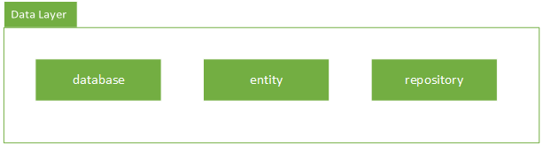

# Android Mitfahren

This is an app created in the course "Android" of the Ostfalia Hochschule für angewandte Wissenschaften in Wolfenbüttel. It lets you create ride requests and also search for them.

## Install
1. Clone the project
2. Build the project with gradlew or open it with Android Studio.

## Table of Content
1. **[General Architecture](#General Architecture)**
2. **[Data Layer](## Data Layer)**
⋅⋅1. **[Database package](### Database package)**
⋅⋅2. **[Entity package](### Entity package)**
⋅⋅3. **[Repository package](### Repository package)**

## General Architecture

As you can see we have divided the application in three layers:
- Data Layer
- Domain Layer
- Presentation Layer

We also have a dependency rule. It goes from the outside to the inner core of the application which is the data layer. This is really important to structure the logic and to encapsulate data.

## Data Layer
The data layer is the lowest layer of the application. It is handling all raw data operations like:
- Creating Data
- Reading Data
- Updating Data
- Deleting Data

So this is a simple [CRUD application](https://en.wikipedia.org/wiki/Create,_read,_update_and_delete).
We decided to use the local database of your android phone because this was a requirement.

We have three packages in this layer:
- Database package
- Entity package
- Repository package

### Database package
The database package contains all the required code for working with the local database. Because we need the database just once we have created a singleton containing the database as property. Also this package has classes which defines table schemes.

### Entity package
Then we have created the entity package which contains the entities **of the database**. Currently we only have one entity which is Ride.

### Repository package
We also have a repository package which is a basic repository and let you easily exchange the persistence component behind the data layer. With this repository pattern it is super easy to change the system to an actual REST api.

The repository needs to implement an interface which contains these methods:
- void InsertOrUpdateRide(Ride ride)
- ArrayList<Ride> SearchRides(String startPoint, String endPoint, long departureTime, SearchType searchType)

You can find more information of the repository in the javadoc.

## Domain Layer

The domain layer contains all the business logic of the application. It has a dependency on the data layer but not on the presentation layer so it should not access instances or other classes, methods, variables of the presentation layer.
The dependency to the data layer is just there to give access to the data. The data will be provided by the repository which was declared earlier.

The domain layer contains three packages:
- Interactor package
- Models package
- Validator package

### Interactor Package

## Presentation Layer

## License
MIT © [Kevin Peters](https://github.com/igeligel) and [Leon Brettin](https://github.com/LeonBre)
